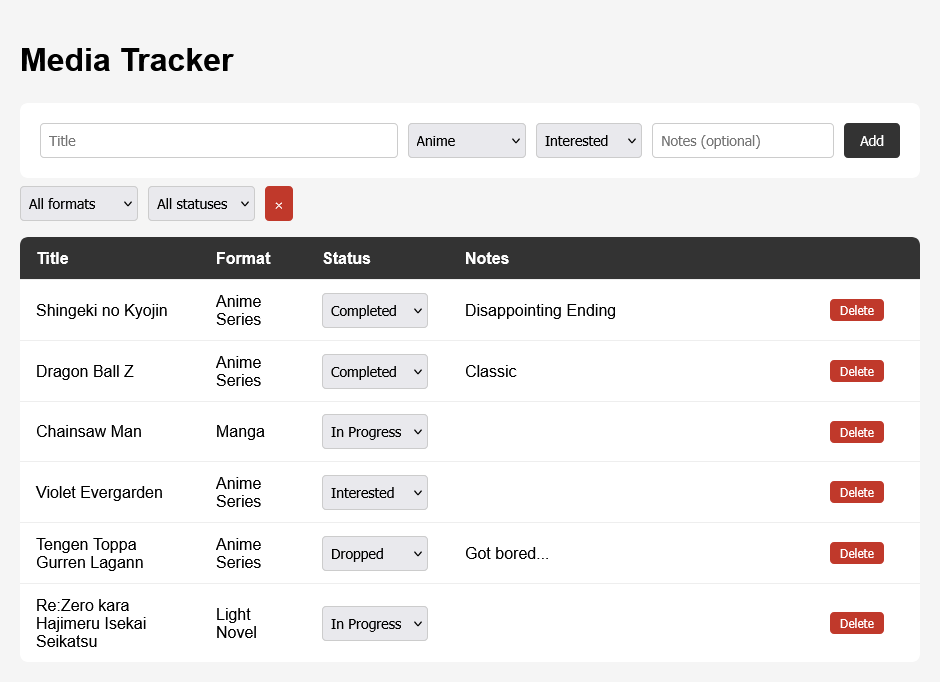
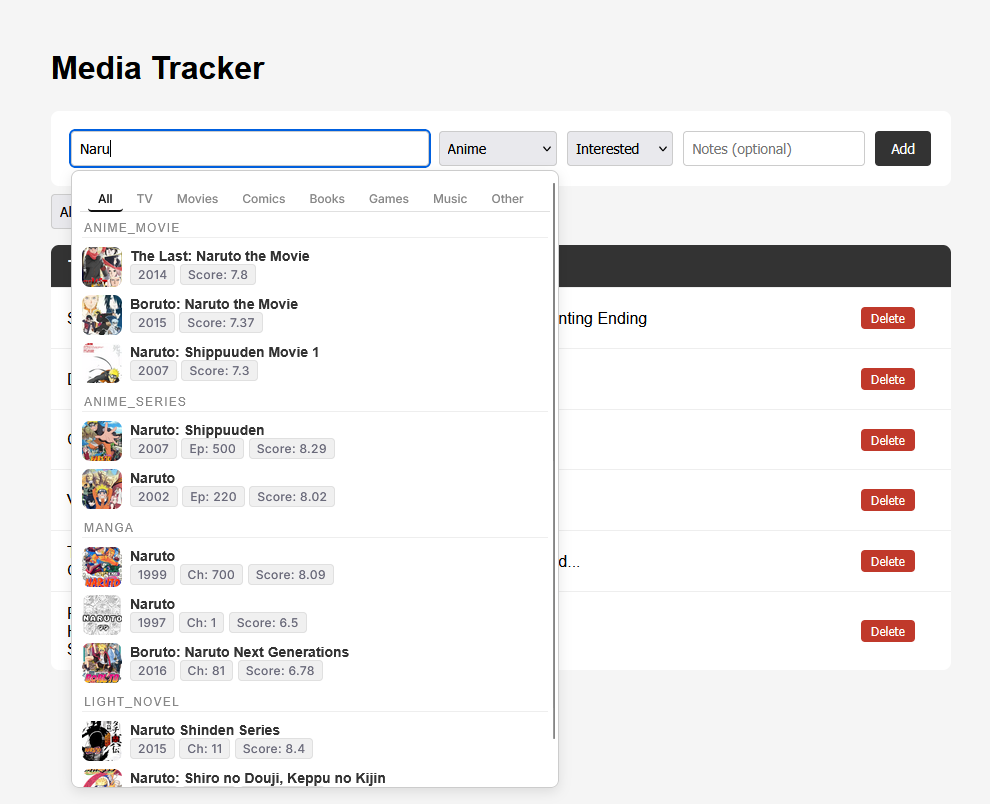

# Media Tracker
A personal media backlog tracker for keeping track of all types of media like games, anime, manga, light novels, web novels, series, and movies — all in one place.

## Motivation
Most popular tracking tools like MyAnimeList only cover one type of media (e.g. animes & mangas, but no video games or books). I wanted a single place to track everything I'm interested in, currently watching, or have finished without the bloat of social features I don't use.

## Screenshot

 
## Features
- Track any type of media: games, anime, manga, light novels, web novels, series, movies
- Add items with a title, type, status, and optional notes
- Prefill the form through a search recommendation that calls external APIs (MyAnimeList, IGDB*) and sorts mediatypes by format and category
- Tab-based filtering of the search recommendations
- Filter by type or status
- Edit status/notes and delete entries directly in the table
- Data persists in a local SQLite database

*IGDB not implemented yet

## Tech Stack
**Backend:** Java 21, Spring Boot 4, Spring Data JPA / Hibernate, SQLite
**Frontend:** HTML, CSS, JavaScript (no frameworks)
**Tools** Maven, IntelliJ

## Running Locally

### Prerequisites
- Java 21 or higher

### Steps
1. Clone the repository and navigate into it
2. Copy `src/main/resources/application-local.properties.template` to `application-local.properties` and fill in your API keys
3. Run `./mvnw spring-boot:run`
4. Open `http://localhost:8080` in your browser

The SQLite database file is created automatically on first run.

## API Keys
This project uses the following external APIs:

- **MyAnimeList** — [register an app here](https://myanimelist.net/apiconfig) to get a Client ID
- **IGDB** — [register on Twitch](https://dev.twitch.tv/console) to get a Client ID and Client Secret (not implemented yet)
- **More APIs** — additional media types and sources planned

Create an `application.properties` file based on `application.properties.example` and fill in your keys.

