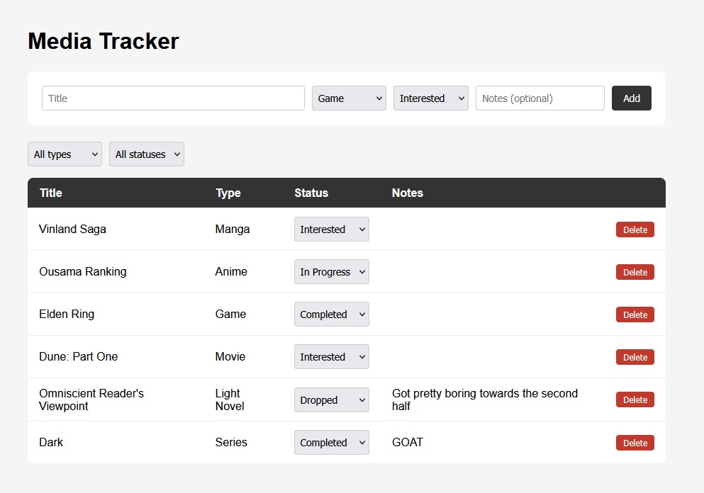

# Media Tracker

A personal media backlog tracker for keeping track of all types of media like games, anime, manga, light novels, web novels, series, and movies — all in one place.

---

## Motivation

Most popular tracking tools like MyAnimeList only cover one type of media (e.g. animes & mangas, but no video games or books). I wanted a single place to track everything I'm interested in, currently watching, or have finished without the bloat of social features I don't use.

---

## Screenshot
 

 
---

---
## Features

- Track any type of media: games, anime, manga, light novels, web novels, series, movies
- Add items with a title, type, status, and optional notes
- Prefill the form through a search query that calls external APIs like myanimelist.net or igdb.com
- Filter by type or status
- Delete items and update your status or notes directly in the table
- Data persists in a local SQLite database

---

## Tech Stack

**Backend**
- Java 21
- Spring Boot 4
- Spring Data JPA / Hibernate
- SQLite

**Frontend**
- Plain HTML, CSS, JavaScript (no frameworks)
- Fetch API for communicating with the backend

**Tools**
- Maven (build and dependency management)
- GitHub Codespaces (development environment)
- IntelliJ
---

## Running Locally

### Prerequisites
- Java 21 or higher

### Steps
1. Clone the repository and navigate into it
2. Run `./mvnw spring-boot:run`
3. Open `http://localhost:8080` in your browser

The SQLite database file is created automatically on first run.

